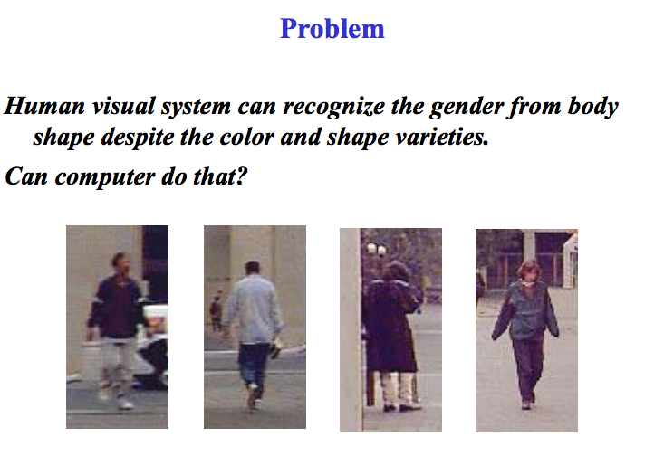

# Gender recognition from body

This dataset is provided with gender labels on the base of MIT pedestrian dataset (http://cbcl.mit.edu/software-datasets/PedestrianData.html). All the images are 64 x 128 pixels, in ppm format. The original dataset in [1] contains 924 images, however, we can only distinguish 600 as male and 288 as female. The other images are too hard to recognize even for human eyes. For the easy use, the images are grouped according to the gender and view directions (foreground/background).

The dataset with gender labels is first labeled for the project of gender recognition from body in Professor Thomas Huang's group in University of Illinois at Urbana-Champaign. We provide the labels here and hope it is useful for any potential academic purpose. However, any use of the dataset must respect the original copyright from MIT CBCL group ( please refer to gender_pedestrian_mm08/readme file).

# Citation

If you use our labels in your work, we will be appreciated if you cite our dataset as

Liangliang Cao, Mert Dikmen, Yun Fu, and Thomas Huang, Gender Recognition from Body, ACM Conf. Multimedia (ACM-MM), 2008.

